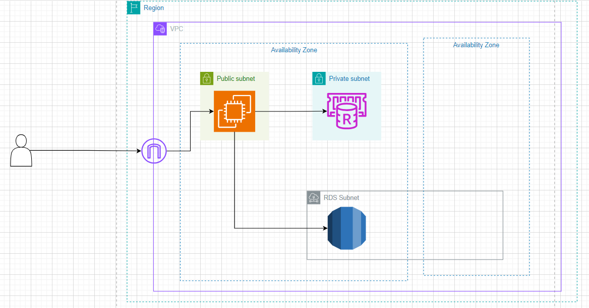

## Building a 3-Tier Application with Node.js, Express, EC2, AWS ElastiCache, and AWS RDS

In this workshop, we will create a 3-tier web application using Node.js and Express. The application will be deployed on AWS EC2, with AWS ElastiCache for caching and AWS RDS for the database.

### Architecture Overview

A 3-tier architecture typically consists of the following layers:

1. **Presentation Layer**: This is the user interface of the application, usually a web page or a mobile app.
2. **Application Layer**: This contains the business logic of the application, typically implemented in a server-side language like Node.js.
3. **Data Layer**: This stores the application’s data, typically in a relational database like MySQL or PostgreSQL.

For this workshop:

- **Node.js with Express** will be used for the application layer.
- **AWS EC2** instances will host our Node.js application.
- **AWS RDS** (Relational Database Service) will host our database.
- **AWS ElastiCache** will be used to cache data for improved performance.
  

### Workshop Outline

1. **Set Up the AWS Environment**

   - Setting VPC
   - Launch an EC2 instance
   - Set up security groups
   - Create an RDS database instance
   - Set up ElastiCache for caching

2. **Build the Node.js Application**

   - Initialize a Node.js project
   - Set up Express
   - Connect to RDS
   - Implement caching with ElastiCache

3. **Test the Application**
   - Verify the application functionality
   - Check caching and database connections
