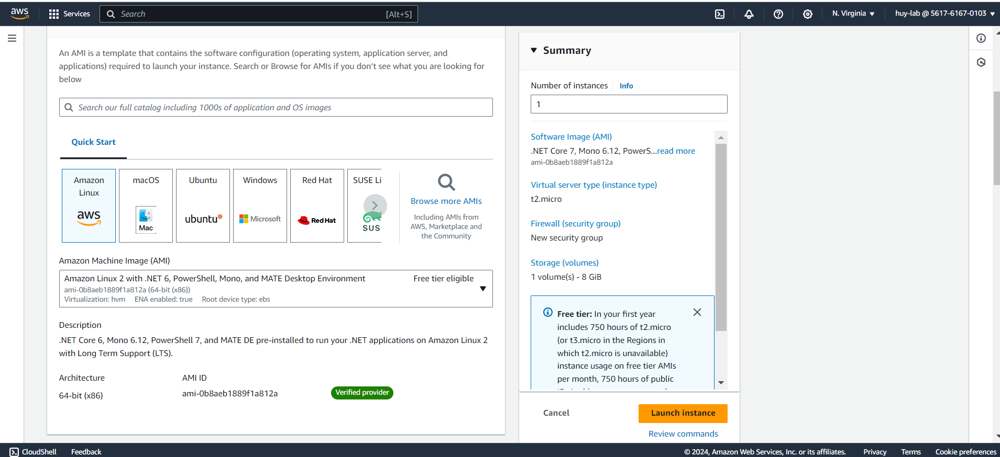
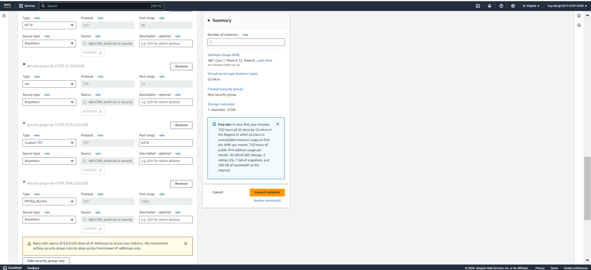

## 2. Launch an EC2 Instance

1. **Go to the** [AWS Management Console](https://aws.amazon.com/console/).  
   

2. **Navigate to EC2** and click on **Launch Instance**.  
   

3. **Choose an Amazon Machine Image (AMI)**. Select the latest **Amazon Linux 2023** AMI (64-bit x86).  
   

4. **Choose an instance type**. **t2.micro** is sufficient for this workshop and is eligible for the free tier.  
   

5. **Configure instance details**:

   - **Network**: Select the default VPC.
   - **Subnet**: Select a default subnet.
   - **Auto-assign Public IP**: Enable.  
     

6. **Configure security group**: Create a new security group or select an existing one.

   - **SSH (port 22)**: Allows you to connect to the instance using SSH.
   - **HTTP (port 80)**: Allows web traffic to your application.
   - **Custom TCP Rule (port 6379)**: For Redis if using ElastiCache with Redis engine.
   - **MySQL/Aurora (port 3306)**: For RDS if using a MySQL database engine.  
     

7. **Launch the instance** and download the key pair for SSH access.
