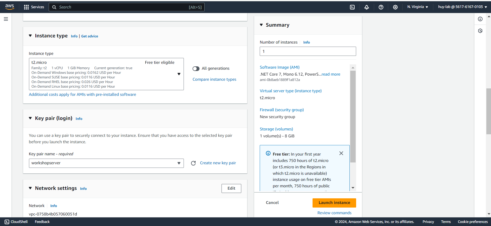

## 2. Khởi động một EC2 Instance

1. **Truy cập vào** [AWS Management Console](https://aws.amazon.com/console/).  
   

2. **Đi tới EC2** và nhấp vào **Launch Instance**.  
   

3. **Chọn một Amazon Machine Image (AMI)**. Chọn **Amazon Linux 2023** AMI (64-bit x86) mới nhất.  
   

4. **Chọn loại instance**. **t2.micro** là đủ cho workshop này và đủ điều kiện cho tier miễn phí.  
   

5. **Cấu hình chi tiết instance**:

   - **Mạng**: Chọn VPC mặc định.
   - **Subnet**: Chọn một subnet mặc định.
   - **Tự động gán địa chỉ IP công cộng**: Bật.  
     

6. **Cấu hình nhóm bảo mật**: Tạo một nhóm bảo mật mới hoặc chọn một nhóm hiện có.

   - **SSH (cổng 22)**: Cho phép bạn kết nối vào instance bằng SSH.
   - **HTTP (cổng 80)**: Cho phép lưu lượng web đến ứng dụng của bạn.
   - **Quy tắc TCP tùy chỉnh (cổng 6379)**: Dành cho Redis nếu sử dụng ElastiCache với engine Redis.
   - **MySQL/Aurora (cổng 3306)**: Dành cho RDS nếu sử dụng engine cơ sở dữ liệu MySQL.  
     

7. **Khởi động instance** và tải về cặp khóa để truy cập SSH.
