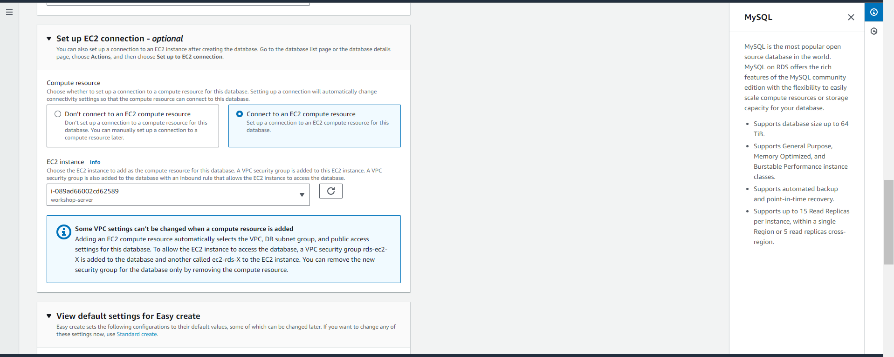

## 3. Khởi động một RDS Instance

1. Truy cập vào [AWS Launch RDS Instance Console].  
   

2. Cấu hình RDS Networking.  
   

3. Khởi động instance.

4. Tải về tệp RPM:

   ```bash
   sudo wget https://dev.mysql.com/get/mysql80-community-release-el9-1.noarch.rpm
   ```
