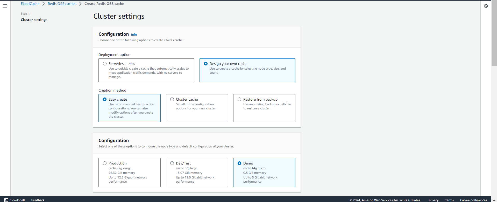

## 4. Khởi động Redis

1. Truy cập vào bảng điều khiển Elastic Cache  
   

2. Khởi động Redis Cluster  
   

3. Cấu hình mạng cho Redis  
   

4. Tải về và thiết lập redis-cli:

   ```bash
   sudo yum install redis6 -y
   ```
