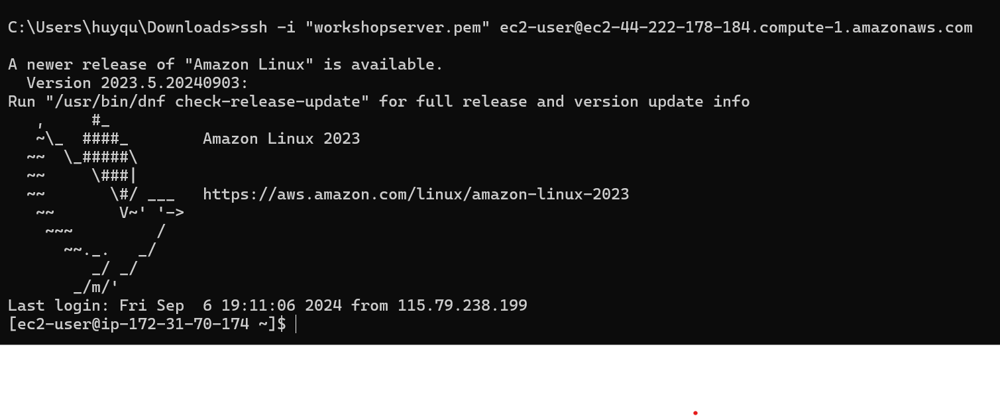
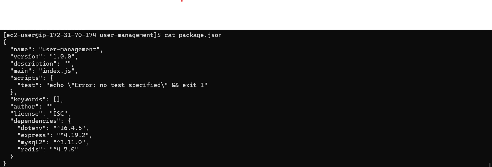

## 5. Cài đặt máy chủ nodejs

1. SSH EC2
   
2. Cài đặt Node.js and npm
   2.1 Cập nhật system packages:

```bash
sudo yum update
sudo yum upgrade
```

2.2 Cài đặt Node.js and npm:

```bash
curl --silent --location https://rpm.nodesource.com/setup_20.x | bash -
sudo yum -y install nodejs
```

** Kiểm tra phiên bản nodejs and npm**

```bash
node -v
npm -v
```

3. Tạo app quản lý người dùng
   3.1 Tạo đường dẫn cho app:

- mkdir user-management
- cd user-management
  3.2 Khởi tạo app:

```bash
npm init -y
```

3.3 Cài đặt dependencies:

```bash
npm install express mysql2 redis dotenv
```

- express: Web framework.
- mysql2: MySQL client for connecting to RDS.
- redis: Redis client for ElastiCache.
- dotenv: For managing environment variables
  ** Check package.json **

```
cat package.json
```


3.4 Create Environment Variables

- Tạo .env file trong thư mục gốc để set biến môi trường.

```bash
vi .env
```

- Thêm cái biến môi trường dưới đây vào file .env:

```bash
DB_HOST=your-rds-endpoint
DB_USER=your-db-username
DB_PASSWORD=your-db-password
DB_NAME=your-db-name
REDIS_HOST=your-elasticache-endpoint
REDIS_PORT=6379
```

3.5 Tạo kết nối MySQL và Redis

- Tạo kết nối MySQL

```bash
vi db.js
```

- Thêm câu hình

```bash
const mysql = require('mysql2/promise');
require('dotenv').config();
const pool = mysql.createPool({
  host: process.env.DB_HOST,
  user: process.env.DB_USER,
  password: process.env.DB_PASSWORD,
  database: process.env.DB_NAME,
});
module.exports = pool;
```

- Tạo kết nối Redis

```bash
vi redis.js
```

- Thêm câu hình

```bash
const redis = require("redis");
require("dotenv").config();
const client = redis.createClient({
  url: `redis://${process.env.REDIS_HOST}:${process.env.REDIS_PORT}`
});
client.on("connect", () => {
  console.log("Connected to Redis");
});
client.on("error", (err) => {
  console.error("Redis error:", err);
});
client.connect();
module.exports = client;
```

3.6 Tạo User Management API

- Tạo the main API trong server.js.

```bash
vi server.js
```

- Thêm code vào file

```bash
const express = require('express');
const pool = require('./db');
const redisClient = require('./redis');
const app = express();

app.use(express.json());

// Get all users (with caching)
app.get('/users', async (req, res) => {
  try {
    const cacheKey = 'users';

    // Check Redis cache first
    const cachedUsers = await redisClient.get(cacheKey);
    if (cachedUsers) {
      return res.json(JSON.parse(cachedUsers));
    }

    // If not in cache, query MySQL
    const [users] = await pool.query('SELECT * FROM users');

    // Cache the result in Redis for 60 seconds
    await redisClient.set(cacheKey, JSON.stringify(users), {
      EX: 60,
    });

    res.json(users);
  } catch (err) {
    res.status(500).json({ error: 'Failed to retrieve users' });
  }
});
// Create a new user
app.post('/users', async (req, res) => {
  const { name, email } = req.body;

  try {
    const [result] = await pool.query('INSERT INTO users (name, email) VALUES (?, ?)', [name, email]);

    // Invalidate cache
    await redisClient.del('all_users');

    res.status(201).json({ id: result.insertId, name, email });
  } catch (err) {
    res.status(500).json({ error: 'Failed to create user' });
}
});

// Start the server
const PORT = process.env.PORT || 3000;
app.listen(PORT, () => {
  console.log(`Server running on port ${PORT}`);
});
```
