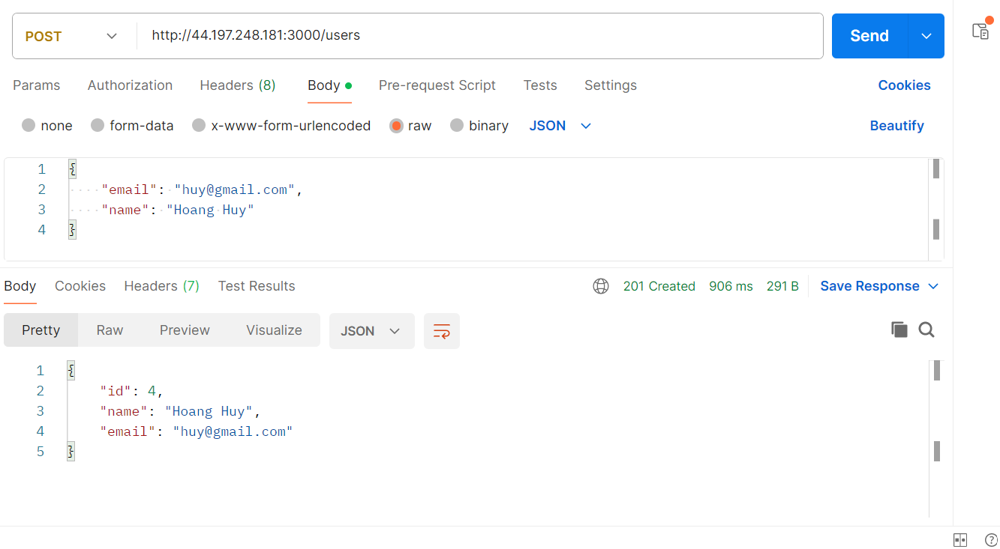
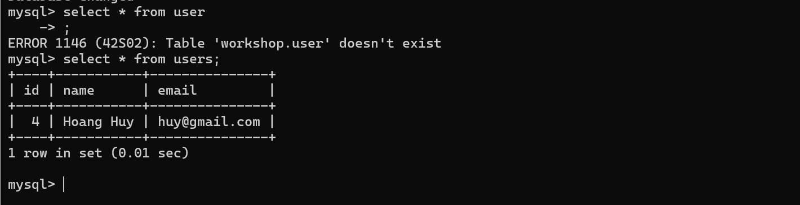
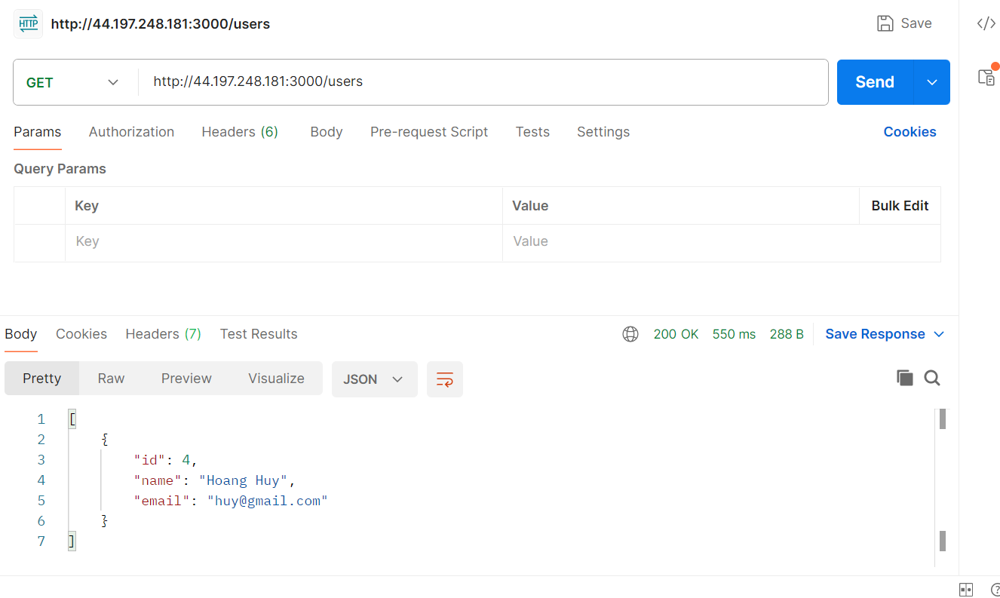
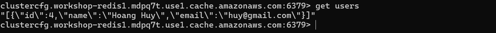

## 6. Kết quả kiểm tra

1. Gửi yêu cầu tới máy chủ EC2 để tạo người dùng. Khi tạo người dùng, bộ nhớ cache sẽ được làm mới.  
   

2. Kiểm tra MySQL RDS.  
   

3. Gửi yêu cầu tới máy chủ EC2 để lấy người dùng. Nếu Redis không còn dữ liệu, hệ thống sẽ ghi dữ liệu mới vào Redis.  
   

4. Kiểm tra Redis.  
   
