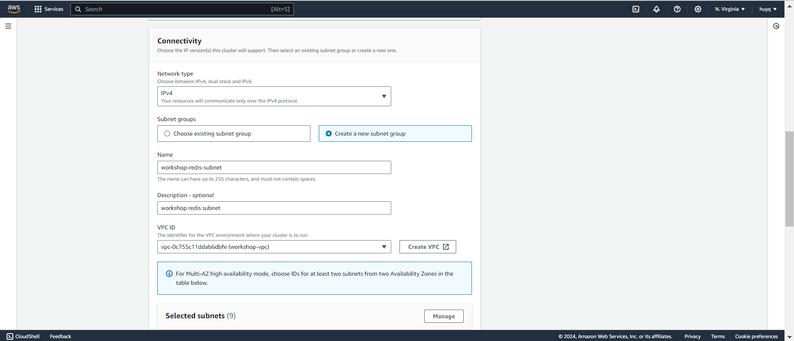

**1.3 Launch a Redis**
1. Go to Elastic Cache console

2. Launch Redis Cluster

3. Setting networking for redis

4. Download and set up redis-cli
```bash
sudo yum install redis6 -y
```
5. Access Redis CLI
```bash
redis6-cli -h <Redis_Cluster_Endpoint> -p <Redis_Port> --tls
```
6. Check Redis CLI
```bash
ping
```


