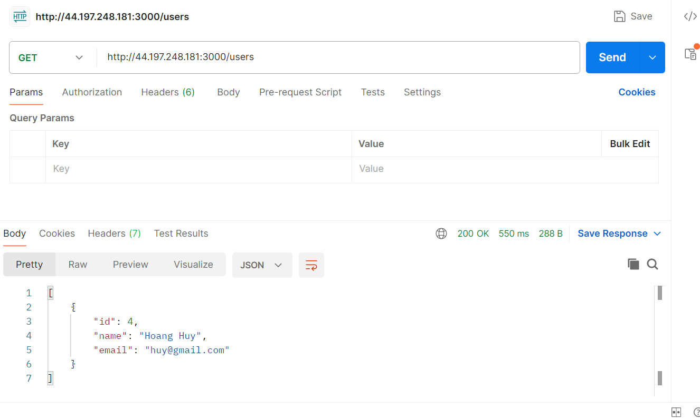

**1.6 Testing Result**

1. Send request to EC2 server to create user, when create user, cache is invalidate

2. Check RDS Mysql

3. Send request to EC2 server to get user, if redis is invalidate, write new data to redis

4. Check Redis
