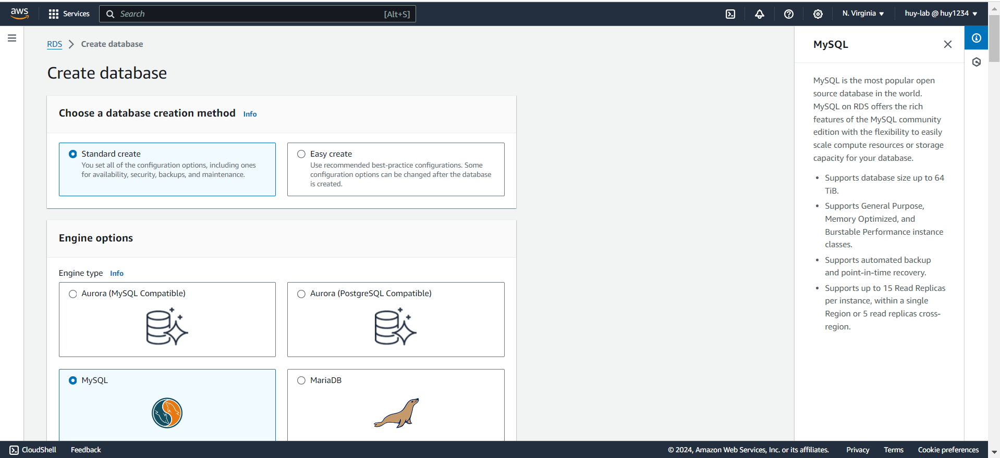

**1.1 Launch an EC2 Instance**

1. Go to the [AWS Launch RDS Instance Console].

2. Set RDS Networking

3. Launch the instance.
4. Download the RPM file
sudo wget https://dev.mysql.com/get/mysql80-community-release-el9-1.noarch.rpm 
5. Install RPM file
sudo dnf install mysql80-community-release-el9-1.noarch.rpm -y
6. You need the public key of mysql to install the software.
sudo rpm --import https://repo.mysql.com/RPM-GPG-KEY-mysql-2023
7. If you need server:
sudo dnf install mysql-community-server -y
8. Access RDS instance in EC2
```bash
mysql -h workshop-db.czysas4gy5ho.us-east-1.rds.amazonaws.com -P 3306 -u admin -p
```
9. Create workshop database
```bash
create database workshop;
```
6. Create user table
```bash
CREATE TABLE users (
  id INT AUTO_INCREMENT PRIMARY KEY,
  name VARCHAR(255),
  email VARCHAR(255)
);
```